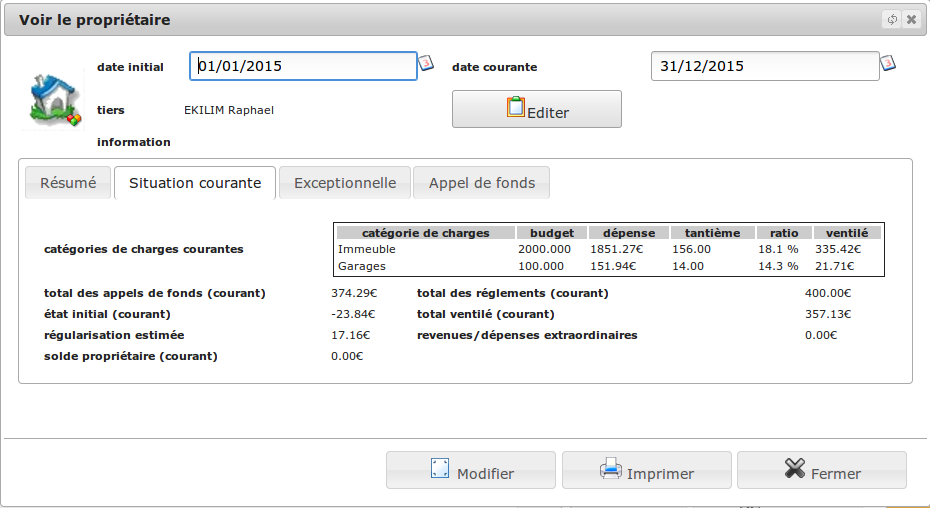

<!--
N.B.: This README was automatically generated by https://github.com/YunoHost/apps/tree/master/tools/README-generator
It shall NOT be edited by hand.
-->

# Diacamma pour YunoHost

[](https://dash.yunohost.org/appci/app/diacamma)  

[](https://install-app.yunohost.org/?app=diacamma)

*[Read this readme in english.](./README.md)*

> *Ce package vous permet d’installer Diacamma rapidement et simplement sur un serveur YunoHost.
Si vous n’avez pas YunoHost, regardez [ici](https://yunohost.org/#/install) pour savoir comment l’installer et en profiter.*

## Vue d’ensemble

# Présentation de Diacamma

_Diacamma_ est un ensemble de logiciels libres et gratuits de gestion administrative et financière imaginé et développé pour les bénévoles.

##Diacamma Asso

**Gérer simplement les adhésions à votre association**

_Diacamma Asso_ vous permet de classer facilement vos adhérents présents et passés.

 * Avoir la liste de vos adhérents avec toutes leurs coordonnées.
 * Gérer leurs cotisations par activités et catégories.
 * Gérer facilement les événements de votre association (examens, stages, sorties, ...).
 * Gérer le stock de votre centrale d'achat associative.
 * Lier une facture à vos cotisations et vos événements.

 
##Diacamma Syndic

**Suivez la situation de votre copropriété**

_Diacamma Syndic_ permet aux syndics bénévoles de gérer simplement leur copropriété.

 * Tenir une comptabilité en conformité avec la réglementation française des copropriétés.
 * Suivre la situation de chaques copropriétaires.
 * Créer et envoyer des appels de fonds.
 * Ventiler les dépenses de la copropriété sur chacun en fonction de ses tantièmes.


**Version incluse :** 23.12.16.17~ynh1

**Démo :** https://asso.diacamma.org

## Captures d’écran




## Documentations et ressources

* Site officiel de l’app : <https://www.diacamma.org>
* Documentation officielle de l’admin : <https://asso.diacamma.org/Docs>
* Dépôt de code officiel de l’app : <https://github.com/Diacamma2>
* YunoHost Store: <https://apps.yunohost.org/app/diacamma>
* Signaler un bug : <https://github.com/YunoHost-Apps/diacamma_ynh/issues>

## Informations pour les développeurs

Merci de faire vos pull request sur la [branche testing](https://github.com/YunoHost-Apps/diacamma_ynh/tree/testing).

Pour essayer la branche testing, procédez comme suit.

``` bash
sudo yunohost app install https://github.com/YunoHost-Apps/diacamma_ynh/tree/testing --debug
ou
sudo yunohost app upgrade diacamma -u https://github.com/YunoHost-Apps/diacamma_ynh/tree/testing --debug
```

**Plus d’infos sur le packaging d’applications :** <https://yunohost.org/packaging_apps>