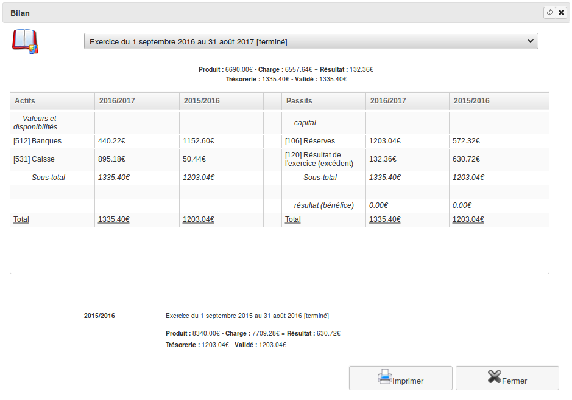
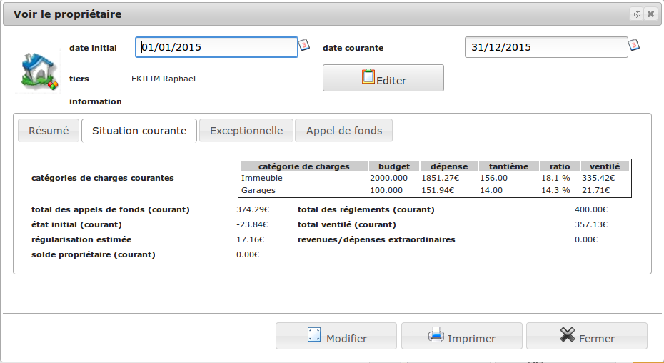
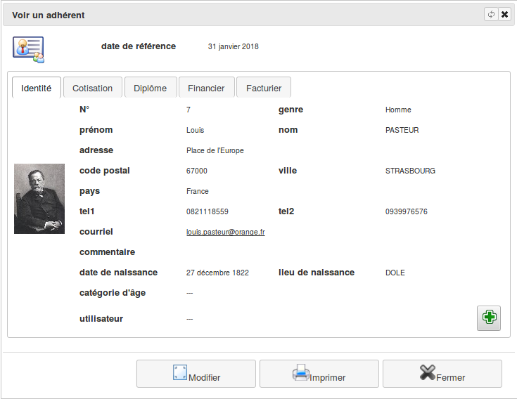

<!--
N.B.: Questo README è stato automaticamente generato da <https://github.com/YunoHost/apps/tree/master/tools/readme_generator>
NON DEVE essere modificato manualmente.
-->

# Diacamma per YunoHost

[](https://dash.yunohost.org/appci/app/diacamma)  

[](https://install-app.yunohost.org/?app=diacamma)

*[Leggi questo README in altre lingue.](./ALL_README.md)*

> *Questo pacchetto ti permette di installare Diacamma su un server YunoHost in modo semplice e veloce.*  
> *Se non hai YunoHost, consulta [la guida](https://yunohost.org/install) per imparare a installarlo.*

## Panoramica

# Diacamma Introduction

_Diacamma_ is a set of free and open source administrative and financial management software designed and developed for volunteers.

## Diacamma Asso

**Simply manage memberships to your association**

_Diacamma Asso_ allows you to easily classify your current and past members.

 * Have a list of your members with all their contact information.
 * Manage their contributions by activities and categories.
 * Easily manage your association events (exams, internships, outings, ...).
 * Manage the stock of your associative purchasing center.
 * Link an invoice to your dues and events.
 
## Diacamma Syndic

**Follow the situation of your condo**

_Diacamma Syndic_ allows voluntary trustees to simply manage their co-ownership.

 * Keep an accounting in accordance with the French regulation of condominiums.
 * Follow the situation of each co-owner.
 * Create and send calls for funds.
 * Break down the expenses of the co-ownership on each one according to its parts.
 


**Versione pubblicata:** 23.12.18.10~ynh1

**Prova:** <https://asso.diacamma.org>

## Screenshot





## Documentazione e risorse

- Sito web ufficiale dell’app: <https://www.diacamma.org>
- Documentazione ufficiale per gli amministratori: <https://asso.diacamma.org/Docs>
- Repository upstream del codice dell’app: <https://github.com/Diacamma2>
- Store di YunoHost: <https://apps.yunohost.org/app/diacamma>
- Segnala un problema: <https://github.com/YunoHost-Apps/diacamma_ynh/issues>

## Informazioni per sviluppatori

Si prega di inviare la tua pull request alla [branch di `testing`](https://github.com/YunoHost-Apps/diacamma_ynh/tree/testing).

Per provare la branch di `testing`, si prega di procedere in questo modo:

```bash
sudo yunohost app install https://github.com/YunoHost-Apps/diacamma_ynh/tree/testing --debug
o
sudo yunohost app upgrade diacamma -u https://github.com/YunoHost-Apps/diacamma_ynh/tree/testing --debug
```

**Maggiori informazioni riguardo il pacchetto di quest’app:** <https://yunohost.org/packaging_apps>
